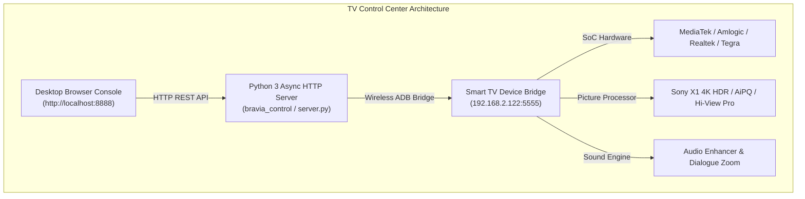

# 📺 TV Control Center — Universal Smart TV Management Suite

[](https://pypi.org/project/tv-control-center/)
[](https://hub.docker.com/repository/docker/ashishdungdung/tv-control-center/general)
[](https://opensource.org/licenses/MIT)
[](https://www.python.org/)
[](https://developer.android.com/)
[](https://github.com/ashishdungdung/tv-control-center)
[](https://buymeacoffee.com/ashishdungdung)

> **Universal desktop system management suite and optimization engine for Sony BRAVIA, NVIDIA SHIELD, TCL, Hisense, Philips, Panasonic, Sharp, Vu, Fire TV, Chromecast, and Xiaomi Smart TVs.**

---

## 🌟 Overview

**TV Control Center** is a high-performance desktop web console that connects wirelessly to your **Smart TV** over **ADB (Android Debug Bridge)**. It allows you to audit hardware, tune performance profiles, calibrate display & audio engines, manage apps, debloat telemetry, configure launchers, and control your TV remotely — all from your laptop or desktop browser.



---

## ⚡ Key Features

- **🗂 Persistent Sidebar Navigation:** Clean, modern SPA shell with Home, Performance, Display, Audio, Network, Apps, Launcher, Remote, Hardware, Activity, Preferences, and About views.
- **🔌 Guided Connect to TV Workflow:** Interactive first-run onboarding modal to enter IP address (`192.168.2.122`), ADB Port (`5555`), and run pre-flight connection checks.
- **⚡ 5-Step Guided Optimization Wizard:** Automated scan, bucketed priority recommendations, snapshot backup, and real sequential ADB property overrides.
- **🎛 Simple / Advanced Mode Toggle:** Hide technical parameters (`debug.sf.hw`, `tcp_window_scaling`) from casual users while giving power users deep low-level control.
- **🔍 Command Palette (`⌘K` / `Ctrl+K`):** Fuzzy-search search bar across all settings, actions, DNS configurations, and page routes.
- **🧹 Memory & Cache Optimization:** Terminate idle background apps and purge application cache vectors with live reclaimed RAM delta measurements.
- **🛡️ 20-Package Safe Debloater:** Easily disable Samba TV tracking (`tv.samba.ssm`), Sony bug reporters, Google TV recommendation ads, and demo stubs.
- **📱 Live App Utilization Telemetry:** Scan all 52+ installed apps, track live PSS memory footprints, and disable unused apps with 1 click.
- **📸 Snapshot & Restore System:** Save and restore full system configuration states locally on host JSON, browser LocalStorage, and TV storage (`/data/local/tmp/`).
- **📦 APK Drag-and-Drop Sideloader:** Sideload APK files directly to your TV by dropping them onto the browser.
- **🎮 Virtual Remote Control:** Wireless D-pad, Home, Back, Menu, Volume controls, and desktop keyboard arrow keys integration.
- **🎨 6 Theme Engines:** Comfortable Day (Default Light), Hardware Night (Dark Console), and 4 Neon accents (Cyan, Violet, Magenta, Amber).

---

## 📺 Supported Devices & Hardware Profiles Matrix

| Brand / Family | Series & Model Lineups Included | Processor & Panel Tech | Key Features |
| :--- | :--- | :--- | :--- |
| **Sony BRAVIA X80 Series** | KD-43X8000H, KD-49X8000H, KD-55X8000H, KD-65X8000H, X80J, X80K, X80L | Sony X1 4K HDR Processor (Direct VA LED) | DSEE Audio + Voice Zoom 3 |
| **Sony BRAVIA X85/X90/X95** | KD-55X9000H, KD-65X9000H, XR-55X90J, XR-65X90K, XR-75X90L | Sony Cognitive Processor XR (Pentonic 1000) | 120Hz VRR + FALD Local Dimming |
| **Sony BRAVIA Master OLED** | KD-55A8H, KD-65A8H, XR-55A80J, XR-65A80K, XR-77A80L, XR-65A95L | Sony Cognitive XR Master Series (QD-OLED) | Acoustic Surface Audio+ |
| **NVIDIA SHIELD TV** | SHIELD TV & SHIELD TV Pro (2017 / 2019) (P2897, P3430) | NVIDIA Tegra X1+ (256-core Maxwell GPU) | AI Upscaling + Dolby TrueHD |
| **TCL Mini-LED QLED** | 55C835, 65C835, 75C845, 65QM850G (C8 Series / QM8) | AiPQ Engine 3.0 (MediaTek MT9615 / Realtek) | 144Hz VRR + Mini-LED QLED |
| **Hisense ULED Mini-LED** | 55U8K, 65U8K, 75U8K, 65U8N (U6K / U7K / U8K / U8N) | Hi-View Engine Pro (Amlogic S905X4) | 144Hz VRR + 2.1.2ch Atmos |
| **Philips Ambilight TV** | 55OLED807, 65OLED808, 55PUS8808 (The One) | P5 AI Perfect Picture Engine (MT9970) | 120Hz OLED + 4-sided Ambilight |
| **Panasonic Master OLED** | TX-55LZ1500, TX-65MZ2000, 55MX950 | HCX Pro AI Processor (MediaTek MT9612) | Master OLED Pro + Technics Sound |
| **Sharp AQUOS 4K** | 4T-C50DN1, 4T-C65EQ1 | X4 Revelation Processor | Deep Chroma Display + Harman/Kardon |
| **Vu GloLED & Masterpiece** | 55GloLED, 65GloLED, 55Masterpiece QLED | Vu Glo Processor (400 nits) | 104W Integrated DJ Subwoofer |
| **Amazon Fire TV** | Fire TV Cube (3rd Gen), Fire TV Stick 4K Max (KFTTR) | Octa-Core 2.0 GHz (Amlogic POP1-G) | Fire OS 7/8 + Dolby Atmos |
| **Google Chromecast** | Chromecast with Google TV (HD/4K) & Google TV Streamer 4K | Amlogic S905X3 / MediaTek MT8696 | Google TV + DoT DNS |
| **Xiaomi Mi Box & Stick** | Mi Box S 4K (MDZ-22-AB), Mi TV Stick 4K, Xiaomi TV Q2 | Amlogic S905X2 / S905Y4 | DTS HD + Android TV 11 |

---

## 🚀 Installation & Quick Start

### Option 1: Install via PyPI (`pip`) — Recommended
```bash
# 1. Install package from PyPI
pip install tv-control-center

# 2. Launch Universal Smart TV Management Suite
tv-control-center serve --port 8888
```
Open **`http://localhost:8888`** in your browser.

---

### Option 2: Run via Docker Hub
Official Docker repository: **[ashishdungdung/tv-control-center](https://hub.docker.com/repository/docker/ashishdungdung/tv-control-center/general)**

```bash
docker run -d \
  --name tv-control-center \
  -p 8888:8888 \
  --restart unless-stopped \
  ashishdungdung/tv-control-center:latest
```
Open **`http://localhost:8888`** in your browser.

---

### Option 3: Install via Homebrew (macOS / Linux)
```bash
# Tap repository & install formula
brew tap ashishdungdung/tap https://github.com/ashishdungdung/tv-control-center
brew install tv-control-center

# Run background service
brew services start tv-control-center
```
Open **`http://localhost:8888`** in your browser.

---

### Option 4: Home Assistant Custom Integration & HACS
Copy `custom_components/tv_control_center/` to your Home Assistant `config/custom_components/` folder:

```bash
cd /config/custom_components/
git clone https://github.com/ashishdungdung/tv-control-center.git /tmp/tvcc
cp -r /tmp/tvcc/custom_components/tv_control_center ./
```
Go to **Home Assistant ➔ Settings ➔ Devices & Services ➔ Add Integration ➔ "TV Control Center"**.

---

### Option 5: Apple HomeKit & Siri (Homebridge Plugin)
Integrate your Smart TV into the **Apple Home** app and control it via **Siri**:

```bash
npm install -g homebridge-tv-control-center
```
Add to your `config.json` under `accessories`:
```json
{
  "accessory": "TVControlCenter",
  "name": "Living Room TV",
  "host": "192.168.2.122",
  "port": 8888
}
```

---

### Option 6: Node-RED Flow Palette
Install custom automation nodes directly inside **Node-RED**:

```bash
cd ~/.node-red
npm install node-red-contrib-tv-control-center
```

---

### Option 7: Hubitat Elevation Groovy Driver
Import `hubitat/tv-control-center-driver.groovy` under **Hubitat ➔ Drivers Code ➔ Import URL**:
`https://raw.githubusercontent.com/ashishdungdung/tv-control-center/main/hubitat/tv-control-center-driver.groovy`

---

### Option 8: Homelab App Store Templates (1-Click Deployment)
- **CasaOS & ZimaOS:** Import `homelab/casaos-app.yaml` in CasaOS App Store.
- **Portainer App Templates:** Import `homelab/portainer-template.json` in Portainer.
- **Unraid OS Community Apps:** Add template URL `https://raw.githubusercontent.com/ashishdungdung/tv-control-center/main/homelab/unraid-tv-control-center.xml`.
- **Umbrel OS:** Import manifest `homelab/umbrel-app.yml`.
- **Synology DSM:** Import Compose file `homelab/synology-compose.yml` in Container Manager.

---

### Option 9: Run from Source Code (GitHub)
```bash
git clone https://github.com/ashishdungdung/tv-control-center.git
cd tv-control-center
python3 -m bravia_control serve --port 8888
```

---

## 💖 Open-Source Sponsorship & Community Support

TV Control Center is 100% free and open-source software. You can sponsor ongoing maintenance and hardware profile expansion:

- ☕ **Buy Me a Coffee:** [buymeacoffee.com/ashishdungdung](https://buymeacoffee.com/ashishdungdung)
- 💖 **GitHub Sponsors:** [github.com/sponsors/ashishdungdung](https://github.com/sponsors/ashishdungdung)

---

## 🤝 Credits & Open-Source Acknowledgments

We gratefully acknowledge the developers of the open-source tools and components integrated into this suite:

- **[Projectivy Launcher](https://github.com/spocky/projengmenu)** by Spocky
- **[FLauncher](https://gitlab.com/efesser/flauncher)** by efesser
- **[Button Mapper](https://buttonmapper.app)** by flar2
- **[SmartTube 4K](https://github.com/yuliskov/SmartTube)** by yuliskov
- **[Google Fonts (Inter & JetBrains Mono)](https://fonts.google.com)** by Google Fonts
- **[Android Debug Bridge (ADB)](https://developer.android.com/tools/adb)** by Google Android Open Source Project

---

## ⚖️ Strict Legal Disclosures & Limitation of Liability

> [!CAUTION]
> **EXPRESS WARRANTY EXCLUSION & LIMITATION OF LIABILITY:**
> TV Control Center is provided **"AS IS"** and **"AS AVAILABLE"** without warranties of any kind, either express, implied, statutory, or otherwise.
> Under no circumstances shall the authors, maintainers, or contributors be held liable for any direct, indirect, incidental, special, exemplary, or consequential damages (including, but not limited to, device bricking, soft-bricking, boot-loops, warranty voidance, data loss, app malfunction, or system instability) arising out of the use or inability to use this software.
>
> All ADB property overrides (`setprop`), package debloating (`pm disable-user`), and network buffer tweaks are executed at the **user's sole risk and discretion**.
>
> For full legal terms, review the [DISCLAIMER.md](DISCLAIMER.md) document.

---

## 📜 Trademark Notice

**Sony®** and **BRAVIA®** are registered trademarks of **Sony Group Corporation**. **Android TV™**, **Google Play™**, **YouTube™**, and **Google TV™** are trademarks of **Google LLC**. **SHIELD®** is a registered trademark of **NVIDIA Corporation**. **Amazon®** and **Fire TV®** are trademarks of **Amazon.com, Inc.**. **MediaTek®**, **Amlogic®**, **Realtek®**, **TCL®**, **Hisense®**, **Philips®**, **Panasonic®**, **Sharp®**, **Vu®**, and **Xiaomi®** are trademarks of their respective copyright holders.

TV Control Center is an independent, community-driven open-source project. It is **not affiliated with, authorized by, maintained by, sponsored by, or endorsed by Sony Group Corporation, Google LLC, NVIDIA Corporation, TCL Electronics, Hisense Co. Ltd., Amazon.com Inc., MediaTek Inc., Philips N.V., Panasonic Corp., Sharp Corp., Vu Technologies, Xiaomi Corp., or any of their subsidiaries**.

---

## 📄 License

This project is licensed under the **MIT License** — see the [LICENSE](LICENSE) file for details.
