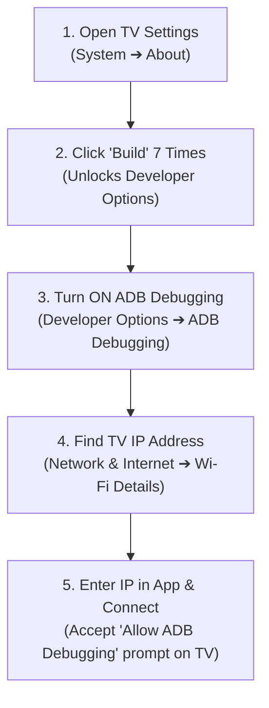

# 📱 TV Connection & Setup Guide

This guide provides step-by-step instructions on how to enable **ADB Debugging** on your Smart TV and connect it to **BRAVIA Control Center**.

---

## 🧭 Visual Setup Flow

---

## 📺 Brand-Specific Setup Instructions

### 1. Sony BRAVIA Android TV & Google TV
1. On your Sony TV remote, press the **Settings (Gear Icon)** button.
2. Navigate to **System** ➔ **About**.
3. Scroll down to **Android TV OS Build** (or **Build**).
4. Press the **OK / Select** button on your remote **7 times repeatedly** until a toast popup appears: *"You are now a developer!"*.
5. Go back to **System** ➔ **Developer Options**.
6. Enable **ADB Debugging** and **Network Debugging**.
7. Note down your TV IP address under **Network & Internet** ➔ **Network Status** (e.g., `192.168.2.122`).

---

### 2. Google TV / Chromecast with Google TV / Google TV Streamer
1. Open **Settings** by selecting your profile icon at top right.
2. Go to **System** ➔ **About**.
3. Scroll down to **Android TV OS Build** and press **OK 7 times**.
4. Return to **System** ➔ **Developer Options**.
5. Toggle **Network Debugging** to **ON**.

---

### 3. NVIDIA SHIELD TV / SHIELD TV Pro
1. Open **Settings** (Gear Icon) on the SHIELD Home Screen.
2. Go to **Device Preferences** ➔ **About**.
3. Scroll down to **Build** and click **7 times**.
4. Go back to **Device Preferences** ➔ **Developer Options**.
5. Enable **Network Debugging**.

---

### 4. TCL & Hisense Smart TVs
1. Go to **Settings** ➔ **System** (or Device Preferences) ➔ **About**.
2. Click **Build** 7 times.
3. Open **Developer Options** and enable **USB Debugging** & **Wireless Debugging**.

---

### 5. Amazon Fire TV Cube / Fire TV Stick
1. Go to **Settings** ➔ **My Fire TV** ➔ **About**.
2. Click on your Fire TV name **7 times**.
3. Go back to **My Fire TV** ➔ **Developer Options**.
4. Turn **ADB Debugging** to **ON**.

---

## 🔌 Connecting via BRAVIA Control Center

1. Launch BRAVIA Control Center on your desktop (`python3 -m bravia_control serve` or open `http://localhost:8888`).
2. Click on the **Connection Indicator** in the sidebar or top bar (or open Settings ➔ Connection).
3. Enter your TV's IP address (e.g., `192.168.2.122`) and click **Connect IP**.
4. ⚠️ **IMPORTANT STEP ON TV SCREEN:** A prompt will pop up on your TV screen:
   > *"Allow network debugging from this computer? (RSA fingerprint: xx:xx...)"*
5. Check **"Always allow from this computer"** and press **OK** on your TV remote.
6. Your TV status will turn **🟢 ADB Connected**!

---

## 🛠 Recommended TV Settings to Enable for Maximum Performance

For the best experience, we recommend enabling the following settings on your TV:

| TV Setting | Menu Location | Recommended Value | Reason |
| :--- | :--- | :--- | :--- |
| **Simple IP Control** | Network ➔ Home Network Setup | **ON** | Allows fast local control over Wi-Fi |
| **RS-232C Control** | Network ➔ RS-232C Control | **Via HDMI Port / Off** | Prevents background polling drops |
| **Auto App Updates** | Google Play Store Settings | **OFF** | Prevents sudden RAM spikes while streaming |
| **Interactive TV Services** | Channels & Inputs ➔ Interactive | **OFF** | Disables Samba TV content tracking |
